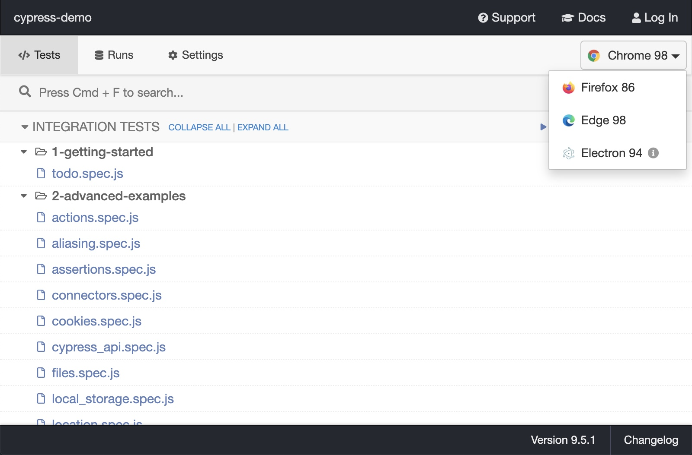
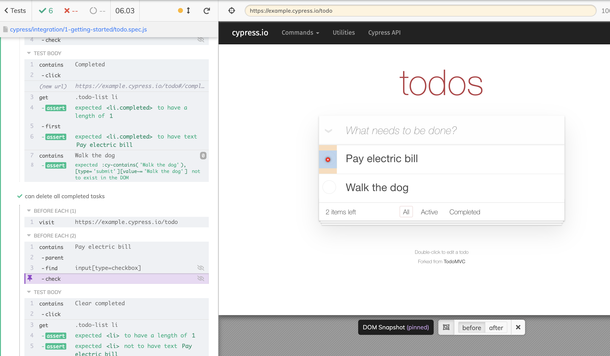
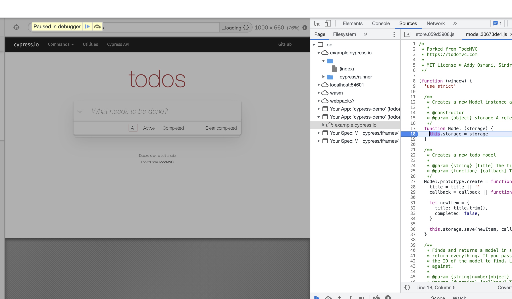

---
# try also 'default' to start simple
theme: seriph
# random image from a curated Unsplash collection by Anthony
# like them? see https://unsplash.com/collections/94734566/slidev
background: https://source.unsplash.com/collection/94734566/1920x1080
# apply any windi css classes to the current slide
class: 'text-center'
# https://sli.dev/custom/highlighters.html
highlighter: shiki
# show line numbers in code blocks
lineNumbers: false
# persist drawings in exports and build
drawings:
  persist: false
---

# Cypress

<p>
前端自动化测试框架体验
</p>

<div class="pt-12">
  <span @click="$slidev.nav.next" class="px-2 py-1 rounded cursor-pointer" hover="bg-white bg-opacity-10">
    Press Space for next page <carbon:arrow-right class="inline"/>
  </span>
</div>

<!--
The last comment block of each slide will be treated as slide notes. It will be visible and editable in Presenter Mode along with the slide. [Read more in the docs](https://sli.dev/guide/syntax.html#notes)
-->

<div class="abs-br m-6 flex gap-2">
  <span  class="px-2 py-1 rounded cursor-pointer">方力</span>
</div>

---

# 什么是 Cypress?

<p class="py-5">
Cypress 称自己是下一代的 web 前端测试工具，是真实运行在浏览器环境下的测试工具，可以对浏览器中运行的任何内容进行快速简单和可靠的测试。
</p>

- 🛠 **环境安装** - 快速安装，没有服务器、驱动程序和其他的依赖或配置
- 📝 **阅读性高** - 用 Cypress 编写的测试脚本易于阅读和理解
- 🧑‍💻 **实时重新加载** - 测试代码修改保存后，Cypress 会自动加载并重新执行测试
- 📷 **日志快照** - Cypress 在测试运行时会拍摄快照，可以准确查看执行的每一步细节
- 🤹 **自动等待** - 不需要在测试代码中处理异步渲染的逻辑
- 🌏 **网络控制** - Cypress 可以 Mock 服务器返回的结果，无需依赖后端服务器，即可实现模拟网络请求
- 🎨 **跨浏览器测试** - 支持在 Firefox 和 Chrome 系列浏览器中运行测试

<br>
<br>

<!--
You can have `style` tag in markdown to override the style for the current page.
Learn more: https://sli.dev/guide/syntax#embedded-styles
-->

<style>
h1 {
  background-color: #2B90B6;
  background-image: linear-gradient(45deg, #4EC5D4 10%, #146b8c 20%);
  background-size: 100%;
  -webkit-background-clip: text;
  -moz-background-clip: text;
  -webkit-text-fill-color: transparent;
  -moz-text-fill-color: transparent;
}
ul li {
  @apply py-1
}
</style>

---

# 安装Cypress

<div class="grid grid-cols-[52%,48%] gap-4">
<!-- <div grid="~ cols-2 gap-4"> -->
<div>

- 系统要求: **Node.js** 12 或 14 及更高版本

```bash
$ cd /your/project/path
$ yarn add cypress --dev # npm install cypress --save-dev
```

- 添加 npm 脚本命令

```javascript
// package.json
{
  ...
  "scripts": {
    "cypress": "cypress open"
  }
  ...
}
```

```bash
$ npm run cypress # yarn cypress
```

[参考文档](https://docs.cypress.io/guides/getting-started/installing-cypress#Installing)
</div>
<div>


#### 切换浏览器

<p>cypress 启动后会尝试在用户的机器上查找所有兼容的浏览器</p>



</div>
</div>


---
layout: image-right

# the image source
image: https://source.unsplash.com/collection/94734566/1920x1080

# a custom class name to the content
class: my-cool-content-on-the-left
---

# 阅读性高，易于理解

cypress 测试用例使用命令式语法编写，对初学者来说是非常友好的

```js
descript('example to-do app', () => {

  beforeEach(() => {
    cy.visit('https://example.cypress.io/todo')
  })

  it('can add new todo items', () => {
    const newItem = 'Feed the cat'

    cy.get('[data-test=new-todo]')
      .type(`${newItem}{enter}`)

    cy.get('.todo-list li')
      .should('have.length', 3)
      .last()
      .should('have.text', newItem)
  })
})
```

---

# 日志快照与可调试性

<div grid="~ cols-2 gap-4">
<div>

<p>用例测试的每一步都有快照，等测试脚本运行结束后，可以通过鼠标选中查看运行时每一步的细节</p>




</div>
<div>

<p>支持使用web浏览器上的开发工具直接调试，有丰富错误和堆栈跟踪信息。</p>



</div>
</div>


---
class: 'text-center'

---
# 自动等待

<p>
在页面某些元素还没出来的时候，通常我们会添加等待的代码
<br>
在cypress中，它会自动等待，直到元素出现，或者达到设定的超时时间
</p>

<div class="grid grid-cols-[50%,50%] gap-4 text-left">

<div>

```javascript
// Jest or Mocha
it('button click should increment the count text', () => {
  expect(wrapper.text()).toContain('0')

  const button = wrapper.find('button')

  button.trigger('click')
  // nextTick 处理异步行为
  Vue.nextTick(() => {
    expect(wrapper.text()).toContain('1')
  })
})
```

[参考](https://v1.test-utils.vuejs.org/zh/guides/testing-async-components.html)

</div>
<div>

```js
// Cypress
// 1.找到元素
// 自动重试，直到找到元素 && 执行 then 方法
cy.get('#element').then(($myElement) => {
    doSomething($myElement)
  })
// 2.达到设定的超时时间
cy.get('#element')
  // 抛出异常中断执行
  .then(($myElement) => {
    doSomething($myElement)
  })

```

</div>
</div>

<style>
  .slidev-layout h1 {
    margin-bottom: 30px;
  }
</style>

---

# 网络控制

<p class="text-sm">
  在 HTTP 请求发送到目标服务器前(HTTP响应后)，可以修改 HTTP 请求 body、headers、URL (响应 body、headers、status、code )
</p>

```js
// 拦截客户端 HTTP 请求
cy.intercept('GET', 'URL', (req) => {
  // 将请求发送到目标服务器
  req.reply()
  // 拦截请求，直接返回 将这个 JSON 对象响应请求
  req.reply({ plan: 'starter' })
  // 将请求发送到目标服务器, 并且拦截服务器返回的实际响应, 然后进行后续操作(类似抓包工具对响应打断点)
  req.reply((res) => {
    return res
  })
})

// 除此之外，还可以主动发起HTTP请求
cy.request('POST', 'http://localhost:8888/users/admin', { name: 'Jane' }).then(
  (response) => {
    // response.data response.status
  }
)
```
参考文档：[intercept](https://docs.cypress.io/guides/guides/network-requests)
and [request](https://docs.cypress.io/api/commands/request)

---
layout: image-left

# the image source
image: https://source.unsplash.com/collection/94734566/1920x1080

# a custom class name to the content
class: my-cool-content-on-the-left
---

# Cypress 的局限

- 不支持多标签测试
- 目前仅支持在 Chrome 和 Firefox 系列的浏览器上运行
- 不支持移动端应用测试
- 不支持 shadowDOM
- 针对 iframe 的支持有限


<style>
ul {
  @apply py-t-10
}
ul li {
  @apply py-1
}
</style>


---

<div grid="~ cols-2 gap-4">
<div>

# 常用的API

```javascript
// 获取DOM元素  返回的是 cypress 对象
cy.get('#id') // 等价 Cypress.$('#id')
cy.get('.class')
cy.get('[data-test=attr]')
cy.get('div > p:nth-child(1) > span')
// 获取包含指定文本的 DOM 元素， 只会返回第一个匹配到的元素
cy.contains('text')
```


```javascript
// 在 cypress 对象基础下获取元素
.find(selector) // 返回被选元素的后代元素
.children() // 获取DON元素的子元素
.parents()  // 获取DOM元素的所有祖先元素
.parent() // 获取被选元素的父元素
.siblings() // 获取被选元素的所有同级元素
.first() // 获取被选元素中的第一个元素   // 等价 .eq(0)
.last() // 获取被选元素的最后一个元素
```

</div>
<div>

```javascript
// 常见操作
cy.url() // 获取页面url
cy.viewport(1024, 768) // 设置窗口大小
cy.go('forward') // cy.go(1)
cy.go('back') // cy.go(-1)
cy.get('#id')
  .invoke('text')
  .then((text) => console.log(text)) // 获取元素 innerText 属性值
cy.get('#input').type('111 {enter}') // 键盘输入
cy.get('#input').clear() // 清除文本
cy.get('#id').trigger(eventName) // 鼠标事件 .trigger('click') 等价 .click()
```

```javascript
// 断言
cy.get('#id')
  .should('exist') // 判断元素是否存在 should('not.exist')

  .should('have.length', 3) // 判断是否匹配到3个DOM元素 .should('not.have.length', 3)
  .should('have.class', 'completed') // 判断元素是否存在 completed 类名
  .should('have.text', 'text') // 判断元素 innerText 是否包含 text 内容
  .should('be.visible') // 判断元素是否可见 .should('not.be.visible')
  .should('have.attr', 'style', 'color: red;') // 判断元素是否存在属性
```

</div>
</div>

---
layout: center
class: text-center
---

<div class="text-background">END</div>
<div class="text-subject">THANKS FOR YOUR <br>WATCHING</div>

<style>
  .slidev-layout {
    color: white;
    background-image: linear-gradient(rgba(0, 0, 0, 0.333), rgba(0, 0, 0, 0.933)), url(https://source.unsplash.com/collection/94734566/1920x1080);
    background-repeat: no-repeat;
    background-position: center center;
    background-size: cover;
    position: relative;
  }
  .text-background,.text-subject {
    position: absolute;
    left: 50%;
    top: 50%;
    transform: translate(-50%, -50%)
  }
  .text-background {
    /* @apply text-sm; */
    opacity: 0.35;
    font-size: 10rem;
    font-family: "Robot",ui-sans-serif,system-ui,-apple-system,BlinkMacSystemFont,"Segoe UI",Roboto,"Helvetica Neue",Arial,"Noto Sans",sans-serif,"Apple Color Emoji","Segoe UI Emoji","Segoe UI Symbol","Noto Color Emoji";

  }
  .text-subject {
    line-height: 2rem;
    @apply text-2xl;
  }
</style>